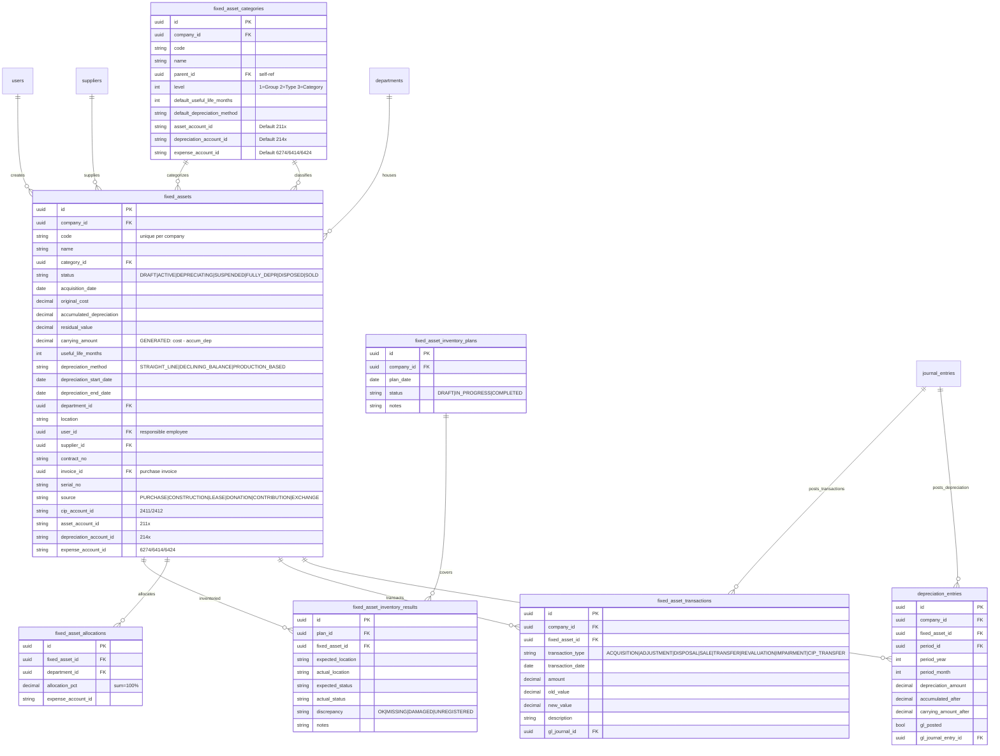
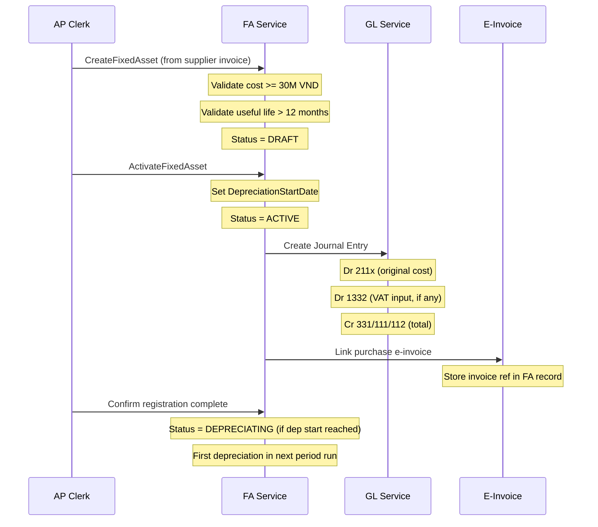
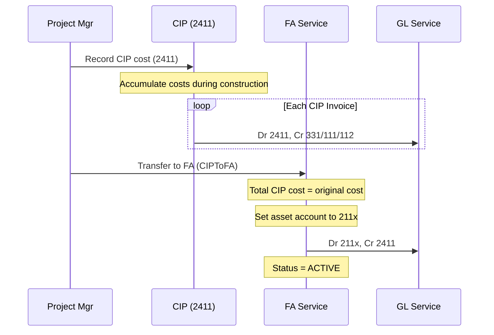
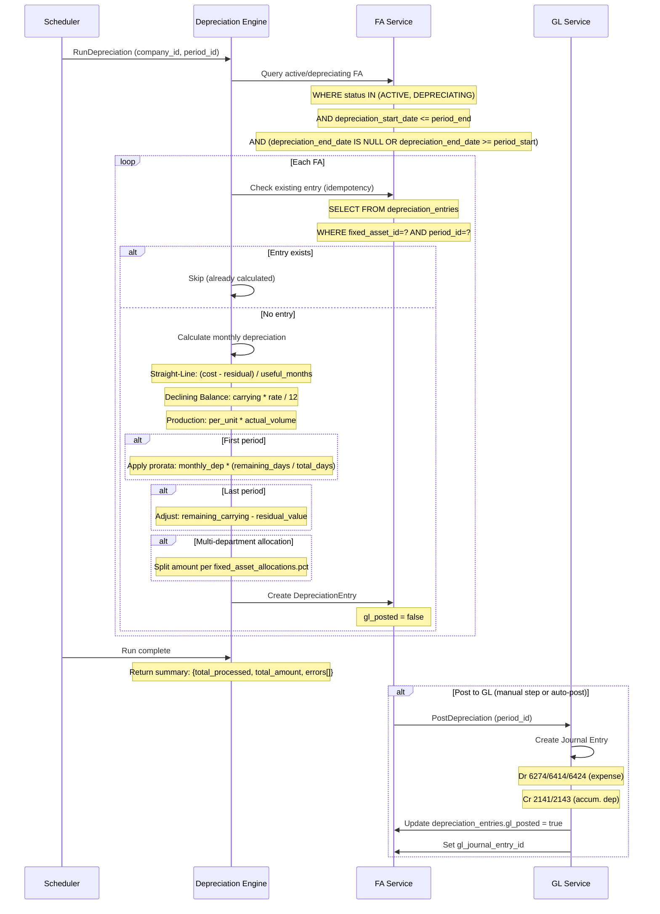
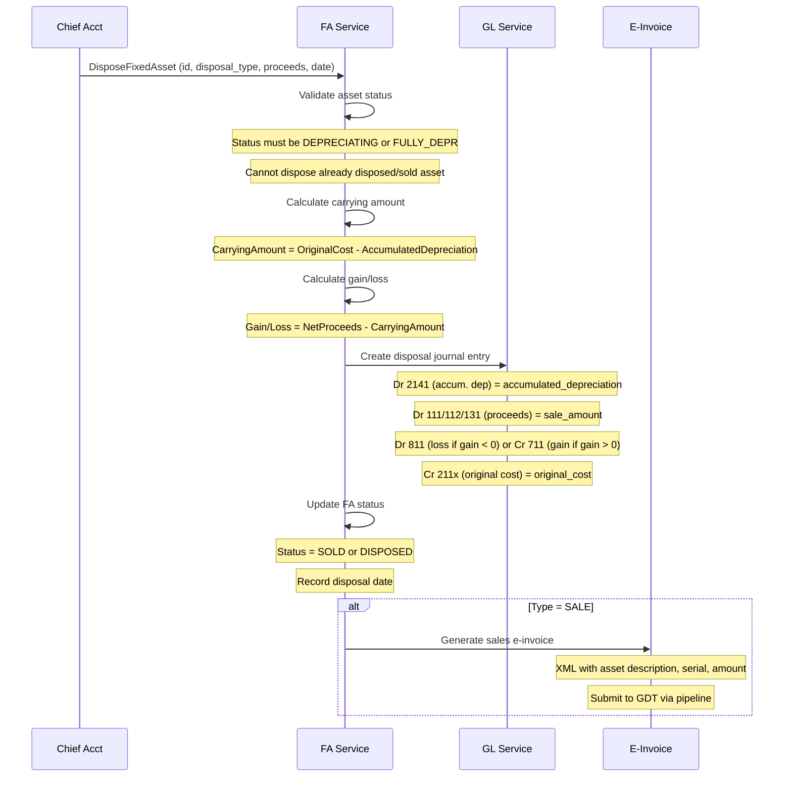
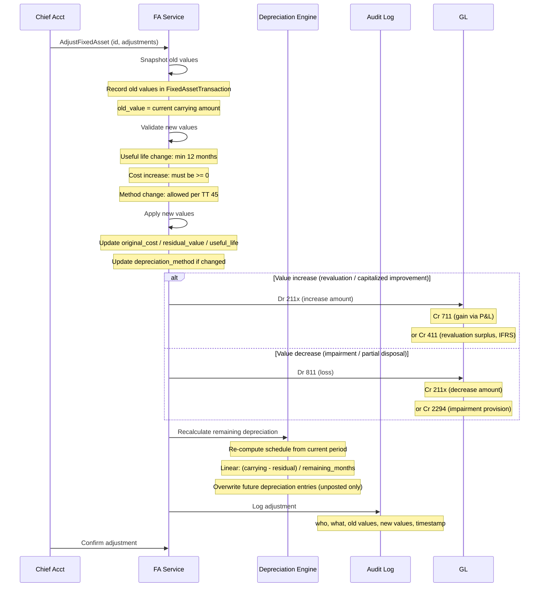
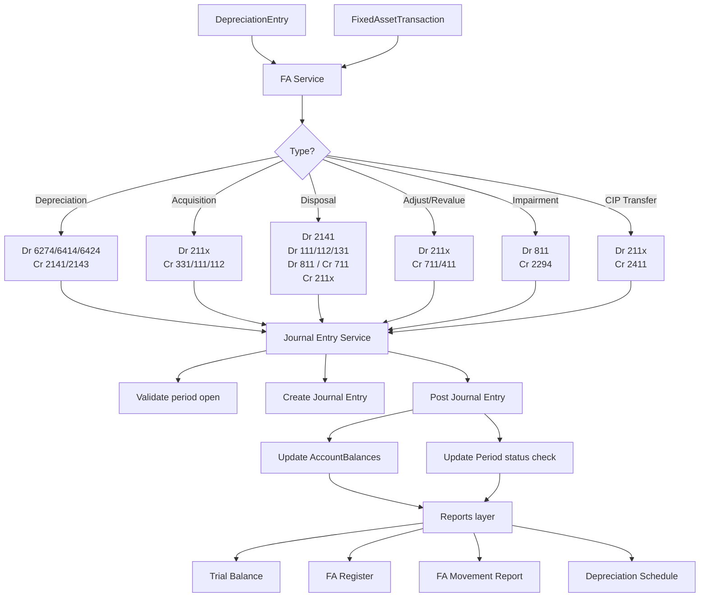
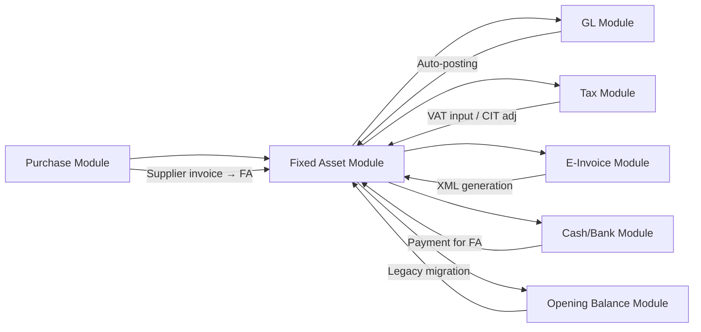
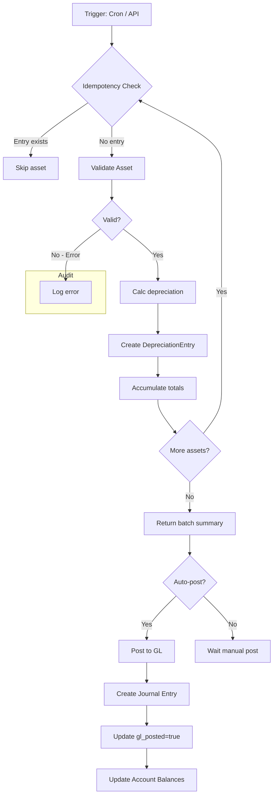
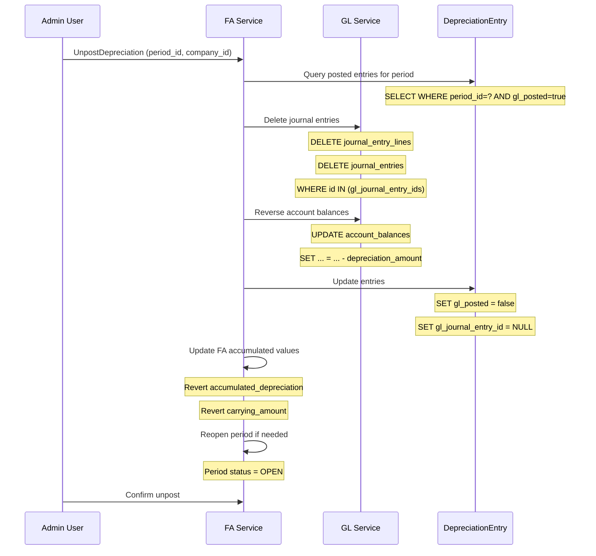

# Fixed Asset Module — Data Flows & Entity Relationships

**Version:** 1.0
**Date:** 2026-07-30
**Author:** BA Lead + Chief Accountant (20+ yrs each)

---

## 1. Entity Relationship Diagram



### Relationship Summary

| Parent | Child | Cardinality | Key |
|--------|-------|-------------|-----|
| `fixed_asset_categories` | `fixed_assets` | 1:N | `category_id` |
| `fixed_assets` | `depreciation_entries` | 1:N | `fixed_asset_id` |
| `fixed_assets` | `fixed_asset_transactions` | 1:N | `fixed_asset_id` |
| `fixed_assets` | `fixed_asset_allocations` | 1:N | `fixed_asset_id` |
| `departments` | `fixed_assets` | 1:N | `department_id` |
| `suppliers` | `fixed_assets` | 1:N | `supplier_id` |
| `users` | `fixed_assets` | 1:N | `created_by` |
| `fixed_asset_inventory_plans` | `fixed_asset_inventory_results` | 1:N | `plan_id` |
| `fixed_assets` | `fixed_asset_inventory_results` | 1:N | `fixed_asset_id` |
| `journal_entries` | `depreciation_entries` | 1:N | `gl_journal_entry_id` |
| `journal_entries` | `fixed_asset_transactions` | 1:N | `gl_journal_id` |

---

## 2. Data Flows

### DF-01: FA Acquisition Flow

**Purpose:** Register new fixed asset from supplier invoice, post to GL, link to e-invoice.

```
Supplier Invoice → FA Registration → Approval → GL Posting → Link to e-invoice
```



**Steps:**

| Step | Action | Data | Validation |
|------|--------|------|------------|
| 1 | Enter FA details | Code, name, category, cost, useful life, method, supplier, invoice | Cost >= 30M VND, useful life > 12mo, category required |
| 2 | Link source document | Supplier invoice, contract, e-invoice ref | Invoice exists, not linked to other FA |
| 3 | Approve activation | Set dep start date, initial status | Chief accountant role required |
| 4 | Post GL entry | Debit 211x, Credit 331/111/112 | Period open, account valid |
| 5 | Link e-invoice | Store e-invoice ID on FA record | E-invoice issued, valid |

**CIP (Construction in Progress) route:**



---

### DF-02: Depreciation Flow

**Purpose:** Calculate monthly depreciation for all active FA, post to GL.

```
Period End → Read Active FA → Calculate per method → Create DepreciationEntry → Create GL Journal Entry → Post
```



**Idempotency check query:**

```sql
SELECT id FROM depreciation_entries
WHERE fixed_asset_id = $1 AND period_id = $2;
```

**GL posting journal structure:**

```
Journal Entry (type=FA_DEPRECIATION, period_id=?, post_date=period_end)
  Line 1: Dr 6274       XXX   (manufacturing overhead)
  Line 2: Dr 6414       XXX   (selling expense)
  Line 3: Dr 6424       XXX   (admin expense)
  Line 4: Cr 2141       XXX   (accum. dep - tangible)
  Line 5: Cr 2143       XXX   (accum. dep - intangible)
```

---

### DF-03: Disposal Flow

**Purpose:** Remove FA from register, calculate gain/loss, post GL, issue e-invoice.

```
Select Asset → Calc CarryingAmount → Enter Proceeds → Create Disposal Transaction → GL Posting → E-invoice
```



**GL journal structure (sale with proceeds):**

```
Journal Entry (type=FA_DISPOSAL, fa_id=?, post_date=disposal_date)
  Line 1: Dr 2141     XXX   (accum. dep - tangible)
  Line 2: Dr 112      XXX   (bank proceeds)
  Line 3: Dr 811      XXX   (loss on disposal, if carrying > proceeds)
  Line 4: Cr 211x     XXX   (original cost)
  Line 5: Cr 711      XXX   (gain on disposal, if proceeds > carrying)
```

**Disposal types matrix:**

| Type | Description | GL Treatment | E-Invoice |
|------|-------------|-------------|-----------|
| SALE | Sell to third party | Dr 2141 + Dr 111/112/131 + Dr 811/Cr 711 + Cr 211x | Required |
| LIQUIDATION | Scrap/abandon | Dr 2141 + Dr 811 + Cr 211x | Not required |
| DONATION | Charitable contribution | Dr 2141 + Dr 811 + Cr 211x | Not required |
| RETURN_LESSOR | Finance lease return | Dr 2141 + Cr 211x (remove both) | Not required |

---

### DF-04: Adjustment Flow

**Purpose:** Modify FA values, useful life, or depreciation method, then recalc remaining schedule.

```
Select Asset → Old Values Snapshot → Enter New Values → Approval → Write Transaction → Update Asset → Recalc Remaining Dep
```



**Adjustment types:**

| Type | Old Value | New Value | GL Impact |
|------|-----------|-----------|-----------|
| Cost increase (capitalized improvement) | original_cost | original_cost + improvement | Dr 211x, Cr 711/331 |
| Cost decrease (partial disposal) | original_cost | original_cost - disposed_portion | Dr 811, Cr 211x |
| Useful life change | remaining_months | new_remaining_months | Recalc future dep only |
| Method change | old_method | new_method | Recalc future dep only |
| Residual value change | old_residual | new_residual | Recalc future dep only |
| Impairment | carrying_amount | recoverable_amount | Dr 811, Cr 2294 |
| Revaluation (increase) | carrying_amount | fair_value | Dr 211x, Cr 411 |
| Revaluation (decrease) | carrying_amount | fair_value | Dr 811, Cr 211x |

---

### DF-05: FA to GL Integration Flow

**Purpose:** All FA transactions that affect financial position are posted to GL for period-end reporting.

```
DepreciationEntry/FA_Transaction → Create JournalEntryLines → Post to Period → Update AccountBalances → Available in Reports
```



**Posting rules:**

| Transaction | Must Post To GL | Posting Trigger |
|-------------|----------------|-----------------|
| FA Acquisition | Yes | On activation |
| Monthly Depreciation | Yes | On period-end post |
| Disposal | Yes | On disposal confirmation |
| Transfer | No (same 211x) | Not applicable |
| Adjustment (value) | Yes | On adjustment approval |
| Revaluation | Yes | On revaluation posting |
| Impairment | Yes | On impairment booking |
| CIP → FA | Yes | On completion transfer |

**Account balance update:**

```sql
UPDATE account_balances
SET debit_total = debit_total + @debit_amount,
    credit_total = credit_total + @credit_amount,
    net_movement = net_movement + (@debit_amount - @credit_amount)
WHERE period_id = @period_id
  AND account_code IN (@debit_account, @credit_account);
```

---

## 3. Volume Estimates

### By Enterprise Tier

| Metric | Small | Medium | Large |
|--------|-------|--------|-------|
| Total FA | 50-200 | 500-2,000 | 2,000-10,000+ |
| Monthly depreciation entries | 50-200 | 500-2,000 | 2,000-10,000 |
| Monthly FA transactions | 5-20 | 20-100 | 100-500 |
| FA categories | 5-20 | 20-50 | 50-200 |
| Department allocations | 2-5 | 5-30 | 30-100 |
| Annual FA additions | 10-30 | 50-500 | 500-2,000 |
| Annual FA disposals | 0-5 | 10-50 | 50-500 |
| Inventory plans per year | 1 | 1-2 | 2-4 |

### Data Growth

| Entity | 1 Year | 5 Years | 10 Years |
|--------|--------|---------|----------|
| Fixed assets | 200-10K | 1K-50K | 2K-100K |
| Depreciation entries | 600-120K | 3K-600K | 6K-1.2M |
| FA transactions | 60-6K | 300-30K | 600-60K |
| Inventory results | 200-10K | 1K-50K | 2K-100K |

### API Response Time Targets

| Endpoint | Target | P99 |
|----------|--------|-----|
| List FA (paginated, filtered) | < 500ms | < 2s |
| Get FA detail (with schedule) | < 200ms | < 500ms |
| Create FA | < 300ms | < 1s |
| Depreciation run (batch) | < 30s for 10K assets | < 60s |
| Post depreciation to GL | < 5s for 10K entries | < 15s |
| Dispose/sell FA | < 500ms | < 1s |
| FA Register report | < 3s | < 10s |
| Depreciation Schedule report | < 5s | < 15s |

### Storage Estimates

| Item | Per Asset | 10K Assets |
|------|-----------|------------|
| FA record | ~1 KB | ~10 MB |
| Depreciation entries (10yr) | ~120 entries | ~1.2M entries, ~200 MB |
| Transactions (10yr) | ~10 entries | ~100K entries, ~20 MB |
| Inventory results | ~1 KB per check | ~10 MB per inventory |
| **Total** | | **~250 MB per 10K FA over 10yr** |

---

## 4. GL Account Mapping Table

### FA Transaction → Debit/Credit

| Transaction Type | Debit Account | Credit Account | Amount | Condition |
|-----------------|---------------|----------------|--------|-----------|
| Acquisition (purchase) | 211x (asset) | 331 (AP) | Original cost | Supplier invoice |
| Acquisition (purchase) | 1332 (VAT input) | 331 (AP) | VAT amount | Invoice has VAT |
| Acquisition (cash) | 211x | 111/112 | Original cost | Cash payment |
| Acquisition (CIP completion) | 211x | 2411 | Total CIP cost | CIP → FA transfer |
| Acquisition (CIP accumulation) | 2411 | 331/111/112 | CIP cost each invoice | During construction |
| Monthly depreciation | 6274 | 2141 | Depreciation amount | Manufacturing FA |
| Monthly depreciation | 6414 | 2141 | Depreciation amount | Selling FA |
| Monthly depreciation | 6424 | 2141 | Depreciation amount | Admin FA |
| Monthly depreciation (intangible) | 6274/6414/6424 | 2143 | Amortization amount | Intangible FA |
| Disposal (remove cost) | 2141 | 211x | Accumulated depreciation | Both sale & liquidation |
| Disposal (remove cost) | 811 | 211x | Carrying amount (loss) | If carrying > proceeds |
| Disposal (proceeds received) | 111/112 | 711 | Sale proceeds (gain) | If proceeds > carrying |
| Disposal (proceeds receivable) | 131 | 711 | Receivable proceeds | Credit sale |
| Disposal (proceeds received, no gain) | 111/112 | 811 | Sale proceeds (loss offset) | If carrying > proceeds |
| Disposal (liquidation, no proceeds) | 811 | 211x | Carrying amount | Full loss |
| Transfer | *No GL posting* | | | Same 211x account |
| Revaluation (increase) | 211x | 711 | Revaluation gain | P&L approach |
| Revaluation (increase) | 211x | 411 | Revaluation surplus | Equity approach (IFRS) |
| Revaluation (decrease) | 811 | 211x | Revaluation loss | P&L approach |
| Impairment (recognition) | 811 | 2294 | Impairment amount | Carrying > recoverable |
| Impairment (reversal) | 2294 | 711 | Reversal amount | Recoverable recovered |
| Improvement (capitalized) | 2414 (CIP) | 331/111/112 | Improvement cost | During improvement |
| Improvement (capitalized, complete) | 211x | 2414 | Total improvement | Capitalize to FA |

### Summary by Account

| Account | Name | Debit | Credit | Type |
|---------|------|-------|--------|------|
| 211x | Tangible FA | Acquisition, revalue increase, improvement | Disposal, revalue decrease | ASSET |
| 2141 | Accum. dep - tangible | Disposal | Monthly depreciation | CONTRA_ASSET |
| 2143 | Accum. amort - intangible | Disposal | Monthly amortization | CONTRA_ASSET |
| 2294 | Impairment provision | Reversal | Impairment recognition | CONTRA_ASSET |
| 2411 | CIP - procurement | Cost accumulation | CIP → FA transfer | ASSET |
| 2414 | CIP - improvement | Improvement cost | Capitalization to FA | ASSET |
| 1332 | VAT input (FA) | Acquisition with VAT | | TAX_ASSET |
| 6274 | Depreciation - mfg | Monthly depreciation | | EXPENSE |
| 6414 | Depreciation - selling | Monthly depreciation | | EXPENSE |
| 6424 | Depreciation - admin | Monthly depreciation | | EXPENSE |
| 811 | Other expenses | Disposal loss, impairment, revalue decrease | | EXPENSE |
| 711 | Other income | | Disposal gain, revalue increase | INCOME |
| 411 | Revaluation surplus | | Revalue increase (IFRS) | EQUITY |
| 331 | Accounts payable | | Acquisition | LIABILITY |
| 111/112 | Cash/Bank | Disposal proceeds | Acquisition | ASSET |
| 131 | Receivables | Disposal credit sale | | ASSET |

---

## 5. Integration with Other Modules



### 5.1 Purchase Module

**Integration point:** Supplier invoice → FA auto-creation.

| Purchase Event | FA Action | Data Flow |
|---------------|-----------|-----------|
| Supplier invoice posted | Create draft FA (optional auto-creation) | Invoice lines with FA flag → FA draft |
| Inventory item → FA transfer | FA registration | Cost from inventory valuation |
| CIP PO completion | CIP → FA transfer | Total PO cost → FA original cost |

**Data contract:**

```go
type PurchaseToFABridge struct {
    SupplierInvoiceID string  `json:"supplier_invoice_id"`
    LineItemID        string  `json:"line_item_id"`
    AssetCode         string  `json:"asset_code"`
    AssetName         string  `json:"asset_name"`
    CategoryID        string  `json:"category_id"`
    OriginalCost      float64 `json:"original_cost"`
    UsefulLifeMonths  int     `json:"useful_life_months"`
}
```

### 5.2 GL Module (Auto-Posting)

**Integration point:** All FA financial transactions post to GL.

| FA Event | GL API Call | Direction |
|----------|-------------|-----------|
| Acquisition | `PostJournalEntry` (Dr 211x, Cr 331) | FA → GL |
| Depreciation run | `PostJournalEntry` (Dr 6274/6414/6424, Cr 2141) | FA → GL |
| Disposal | `PostJournalEntry` (Dr 2141, Dr 112, Dr 811/Cr 711, Cr 211x) | FA → GL |
| Adjustment/Revalue | `PostJournalEntry` (Dr/Cr 211x, Cr/Dr 711/411) | FA → GL |
| Impairment | `PostJournalEntry` (Dr 811, Cr 2294) | FA → GL |

**GL constraints:**

- Period must be open before posting
- Journal entries use existing `PostJournalEntry` service method
- FA GL posting uses distinct journal entry types for audit trace
- Unpost depreciation reverses the journal entry (deletes it, reopens period)

### 5.3 Tax Module

**Integration point:** VAT input on FA purchase, CIT adjustment for depreciation.

| Tax Area | FA Impact | Handling |
|----------|-----------|----------|
| VAT declaration | Input VAT on FA purchase (1332) | Account 1332 balance included in VAT declaration indicator [25] |
| CIT adjustment | Depreciation method diff (tax vs accounting) | Track tax depreciation book if different from accounting book |
| FA sale VAT | Output VAT on FA disposal | Included in sales ledger, VAT declaration indicator [21] |
| Import tax | Import duties on imported FA (3332/3333) | Capitalized into FA cost |
| Land tax | Land use rights amortization | Track via intangible FA (213) |
| Pillar 2 (GMT) | FA carrying amount in GloBE income | FA register data used for GMT calculation |

**VAT input eligibility per FA type:**

| FA Type | VAT Account | Eligible | Condition |
|---------|-------------|----------|-----------|
| Office building (2111) | 1332 | Yes | Used for taxable activities |
| Factory (2112) | 1332 | Yes | Manufacturing input |
| Vehicle (2113) | 1332 | Yes | Business use only |
| Equipment (2114) | 1332 | Yes | Production/business use |
| Intangible (213) | 1332 | Yes | Software, patents for business |
| Passenger car (2113) | 1332 | Partial | ≥ 1.6B VND: VAT capped |
| Imported FA | 3332/3333 | N/A | Import tax + duties capitalised |

### 5.4 Cash / Bank Module

**Integration point:** Payment for FA acquisition, disposal proceeds.

| FA Event | Bank Module Action | Direction |
|----------|--------------------|-----------|
| FA purchase payment | Create `PaymentOrder` to supplier | FA → Bank (via GL) |
| FA disposal proceeds | Receive money from buyer | FA → Bank (via GL) |
| CIP payment | Progress payment to contractor | FA → Bank (via GL) |

**Sequence (FA purchase payment):**

```
FA Acquisition → GL Posting (Dr 211x, Cr 331)
  → AP aging includes this invoice
  → AP Clerk initiates payment via Bank module
  → Bank: PaymentOrder (Dr 331, Cr 112)
  → Invoice balance_due updated
```

### 5.5 E-Invoice Module

**Integration point:** XML generation for FA sale, linking purchase e-invoice to FA.

| FA Event | E-Invoice Action | GDT Template |
|----------|-----------------|--------------|
| FA acquisition | Link existing purchase e-invoice to FA record | Supplier e-invoice XML |
| FA sale | Generate sales e-invoice with FA details | 01GTKT (sales invoice) |
| FA liquidation | No e-invoice | N/A |

**E-invoice data for FA sale:**

```xml
<Invoice>
  <Buyer>
    <BuyerName>{{ buyer_name }}</BuyerName>
    <BuyerTaxCode>{{ buyer_tax_code }}</BuyerTaxCode>
  </Buyer>
  <Items>
    <Item>
      <Description>Bán TSCĐ: {{ asset_name }}</Description>
      <Unit>Chiếc</Unit>
      <Quantity>1</Quantity>
      <UnitPrice>{{ sale_amount }}</UnitPrice>
      <VatRate>{{ vat_rate }}</VatRate>
    </Item>
  </Items>
  <TotalAmountWithoutVAT>{{ subtotal }}</TotalAmountWithoutVAT>
  <TotalVATAmount>{{ vat_amount }}</TotalVATAmount>
  <TotalAmountWithVAT>{{ grand_total }}</TotalAmountWithVAT>
</Invoice>
```

### 5.6 Opening Balance Module

**Integration point:** Legacy FA migration during GoTax onboarding.

| OB Field | Maps To | Note |
|----------|---------|------|
| `DetailFixedAsset` | FA entity type | Identifies FA opening balances |
| `OriginalCost` | `fixed_assets.original_cost` | From legacy system |
| `AccDepreciation` | `fixed_assets.accumulated_depreciation` | Accumulated to migration date |
| `MigrationDate` | `depreciation_start_date` | First depreciation period after migration |

**Migration process:**

```
1. Export FA from legacy system (Excel/CSV)
2. Import via FA bulk import (POST /api/v1/fixed-assets/import)
3. Set status = DEPRECIATING
4. Set original_cost, accumulated_depreciation from OB data
5. Set carrying_amount = original_cost - accumulated_depreciation
6. First depreciation run calculates from migration date forward
7. No retroactive depreciation entries created
```

---

## 6. Batch Processing Architecture

### 6.1 Depreciation Calculation — Batch Job



**Batch configuration:**

```go
type DepreciationBatchConfig struct {
    CompanyID    string `json:"company_id"`
    PeriodID     string `json:"period_id"`
    AutoPost     bool   `json:"auto_post"`      // Post to GL immediately
    DryRun       bool   `json:"dry_run"`        // Calculate without saving
    AssetIDs     []string `json:"asset_ids,omitempty"` // Specific assets only
    Concurrency  int    `json:"concurrency"`     // Goroutine count (default: 4)
}
```

**Algorithm:**

```
1. Lock period (prevent concurrent runs)
2. Query all ACTIVE/DEPRECIATING assets for company
3. For each asset (parallel workers, bounded concurrency):
   a. Check idempotency (asset_id + period_id unique)
   b. Validate status, dates, method
   c. Calculate monthly amount
   d. Apply prorata / last period adjustment
   e. Split by allocation if multi-department
   f. Create DepreciationEntry (NOT NULL, gl_posted=false)
4. If any error: log, continue (don't abort batch)
5. Return summary: {processed, skipped, errors, total_amount}
6. If auto_post: call PostDepreciation
```

### 6.2 Idempotency

**Rule:** Same `(fixed_asset_id, period_id)` pair cannot produce duplicate.

**Enforced at two levels:**

1. **DB constraint:**
   ```sql
   CREATE TABLE depreciation_entries (
       ...
       UNIQUE(fixed_asset_id, period_id)
   );
   ```

2. **Application check:**
   ```go
   func (s *FAService) calculateDepreciation(ctx, assetID, periodID string) error {
       existing, err := s.repo.GetDepreciationEntry(ctx, assetID, periodID)
       if existing != nil {
           return ErrDepreciationAlreadyCalculated // skip, not error
       }
       // proceed with calculation
   }
   ```

### 6.3 Rollback (Unpost)

**Purpose:** Reverse posted depreciation to allow corrections or period reopening.



**Rollback steps:**

| Step | Action | Data Affected |
|------|--------|---------------|
| 1 | Find all posted depreciation entries for period | `depreciation_entries WHERE gl_posted=true AND period_id=?` |
| 2 | Collect unique GL journal entry IDs | `gl_journal_entry_id` list |
| 3 | Delete GL journal entry lines | `journal_entry_lines` |
| 4 | Delete GL journal entries | `journal_entries` |
| 5 | Reverse account balance updates | `account_balances` (subtract depreciation) |
| 6 | Mark entries as unposted | `depreciation_entries.gl_posted = false, gl_journal_entry_id = NULL` |
| 7 | Revert FA accumulated values | `fixed_assets.accumulated_depreciation -= sum(entries)` |

**Constraints:**

- Only chief accountant or admin can unpost
- Cannot unpost if period is locked/finalized
- Cannot unpost individual entries — must unpost entire period
- After unpost, depreciation can be recalculated and re-posted

### 6.4 Batch Run Audit Log

Every batch run creates an audit record:

```sql
CREATE TABLE fa_batch_audit (
    id UUID PRIMARY KEY DEFAULT gen_random_uuid(),
    company_id UUID NOT NULL REFERENCES companies(id),
    batch_type VARCHAR(20) NOT NULL,  -- DEPRECIATION, UNPOST
    period_id UUID REFERENCES periods(id),
    period_year INTEGER,
    period_month INTEGER,
    status VARCHAR(20) NOT NULL,       -- RUNNING, COMPLETED, FAILED, PARTIAL
    total_assets INTEGER,
    processed_count INTEGER,
    skipped_count INTEGER,
    error_count INTEGER,
    total_amount DECIMAL(20,2),
    gl_posted BOOLEAN NOT NULL DEFAULT FALSE,
    started_at TIMESTAMPTZ NOT NULL DEFAULT NOW(),
    completed_at TIMESTAMPTZ,
    started_by UUID NOT NULL REFERENCES users(id),
    error_details JSONB,               -- Array of {asset_id, code, error}
    metadata JSONB                     -- Batch config snapshot
);
```

**Audit log purposes:**

- Trace which period's depreciation was calculated when, by whom
- Identify assets that failed calculation (with error messages)
- Support rollback by knowing exactly which GL entries to reverse
- Measure batch performance (start → end duration)

### 6.5 Error Handling

| Error | Severity | Action |
|-------|----------|--------|
| Asset not in DEPRECIATING state | Warning | Skip, log in audit |
| Period already calculated (idempotent) | Info | Skip, count as skipped |
| Invalid depreciation method | Error | Skip, log in audit with asset code |
| Asset dates outside period | Warning | Skip asset |
| GL posting period closed | Fatal | Abort batch, rollback all |
| DB connection failure | Fatal | Retry 3x, then abort |
| Division by zero (0 useful life) | Error | Skip, log for manual fix |

### 6.6 Scheduled Execution

```yaml
# Suggested cron schedule
Depreciation calculation:
  cron: "0 2 1 * *"       # 2:00 AM on 1st of each month
  description: "Run depreciation for previous month"
  scope: all active companies

Depreciation auto-post:
  cron: "0 3 1 * *"       # 3:00 AM on 1st (after calculation)
  description: "Post calculated depreciation to GL"
  depends_on: depreciation_calculation

FA aging report generation:
  cron: "0 6 1 * *"       # 6:00 AM on 1st
  description: "Generate FA aging report snapshot"

Inventory reminder:
  cron: "0 8 1 12 *"     # 8:00 AM Dec 1 (annual inventory)
  description: "Remind FA accountant to plan annual inventory"
```

### 6.7 Concurrency Model

```go
// Worker pool for depreciation calculation
func (s *FAService) RunDepreciationBatch(ctx, config) (*BatchResult, error) {
    assets, err := s.repo.ListActiveAssets(ctx, config.CompanyID)
    if err != nil { return nil, err }

    sem := make(chan struct{}, config.Concurrency) // bounded concurrency
    resultCh := make(chan *AssetResult, len(assets))

    for _, asset := range assets {
        go func(a *FixedAsset) {
            sem <- struct{}{}        // acquire
            defer func() { <-sem }() // release

            entry, err := s.calculateOne(ctx, a, config.PeriodID)
            resultCh <- &AssetResult{AssetID: a.ID, Entry: entry, Error: err}
        }(asset)
    }

    // Wait for all goroutines
    for i := 0; i < len(assets); i++ {
        res := <-resultCh
        // accumulate results
    }

    return summary, nil
}
```

---

**Related documents:**
- [FA_BRD.md](FA_BRD.md) — Business requirements
- [FA_SPECS.md](FA_SPECS.md) — Technical specifications, data models, API endpoints
